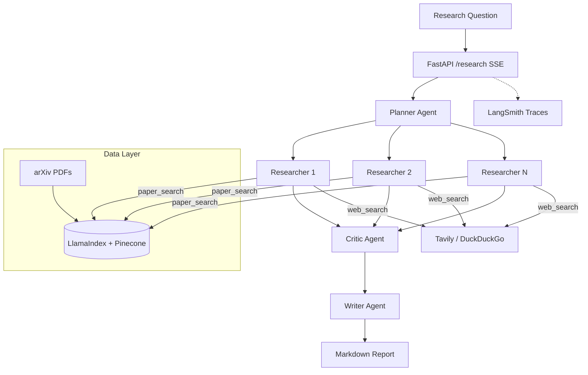

# Research Lab

[](https://github.com/vc-tr/research-lab/actions/workflows/ci.yml)
[](LICENSE)

A multi-agent research assistant that takes a question and produces a cited Markdown report. Built with **CrewAI**, **LangChain**, **LlamaIndex**, **Pinecone**, and **LangSmith**.

## Architecture



## Quickstart

```bash
# Clone and install
git clone <repo-url> && cd research-lab
uv sync
cp .env.example .env
# Edit .env with your API keys

# Download seed papers
uv run python scripts/download_papers.py

# Build the index (optional if USE_PINECONE=false)
uv run python -m research_lab.retrieval.indexer

# Run via CLI
uv run research-lab "What are recent advances in retrieval-augmented generation?"

# Run via API
uv run uvicorn research_lab.api.app:app --reload
# POST http://localhost:8000/research with {"question": "..."}

# Docker
docker compose up
```

## No Anthropic Credits?

Use **Groq** for free LLM access (generous free tier, no credit card):

1. Get a free API key at https://console.groq.com/keys
2. In `.env`:
   ```bash
   LLM_PROVIDER=groq
   GROQ_API_KEY=gsk_...
   DEFAULT_MODEL=llama-3.3-70b-versatile
   ```

The same multi-agent pipeline works — only the underlying LLM changes.

## No Pinecone Account?

Set `USE_PINECONE=false` in your `.env` file. The system falls back to LlamaIndex's in-memory `SimpleVectorStore` — no external services needed.

## Running Tests

```bash
uv run pytest tests/ -v          # All tests (mocked, no API keys)
uv run ruff check .              # Lint
uv run mypy --strict src/        # Type check
```

## Running Evals

```bash
# Full eval (requires ANTHROPIC_API_KEY)
uv run python -m evals.runner --questions evals/questions.yaml

# Smoke test (fake LLM, <60s)
uv run pytest tests/test_evals_smoke.py -v
```

## Adding a New Tool

1. Create a CrewAI `BaseTool` subclass in `src/research_lab/retrieval/`
2. Add it to the tool list in `crew.py::_build_researcher_tools()`
3. Write a test in `tests/test_retrieval.py`

## Adding a New Agent

1. Create a factory function in `src/research_lab/agents/`
2. Add the agent and its task in `crew.py::build_crew()`
3. Re-export from `src/research_lab/agents/__init__.py`

## Adding an Eval Question

Add an entry to `evals/questions.yaml`:
```yaml
- id: q11
  question: "Your question here"
  expected_topics: ["topic1", "topic2"]
  rubric_notes: "What the answer should cover."
```

## Paper Corpus

20 arXiv papers covering agentic AI, RAG, LLM evaluation, and efficiency:

| arXiv ID | Title |
|:---------|:------|
| 2210.03629 | ReAct: Synergizing Reasoning and Acting in Language Models |
| 2302.04761 | Toolformer: Language Models Can Teach Themselves to Use Tools |
| 2005.11401 | Retrieval-Augmented Generation for Knowledge-Intensive NLP Tasks |
| 2312.10997 | RAG Survey: Retrieval-Augmented Generation for AI-Generated Content |
| 2310.11511 | Self-RAG: Learning to Retrieve, Generate, and Critique |
| 2309.15217 | RAGAS: Automated Evaluation of Retrieval Augmented Generation |
| 2310.06825 | DSPy: Compiling Declarative Language Model Calls |
| 2402.14207 | STORM: Synthesis of Topic Outlines through Retrieval and Multi-perspective QA |
| 2308.08155 | AutoGen: Enabling Next-Gen LLM Applications via Multi-Agent Conversation |
| 2303.17580 | HuggingGPT: Solving AI Tasks with ChatGPT and its Friends |
| 2305.10601 | Tree of Thoughts: Deliberate Problem Solving with Large Language Models |
| 2307.09288 | Llama 2: Open Foundation and Fine-Tuned Chat Models |
| 2312.06648 | Mixtral of Experts |
| 2401.04088 | DeepSeek-V2: A Strong, Economical, and Efficient MoE LLM |
| 2305.14314 | QLoRA: Efficient Finetuning of Quantized Language Models |
| 2402.01680 | LLM Judges: A Survey on LLM-as-a-Judge |
| 2404.10667 | Many-Shot In-Context Learning |
| 2305.18290 | Direct Preference Optimization (DPO) |
| 2312.11805 | The Landscape of Emerging AI Agent Architectures |
| 2406.12832 | GraphRAG: From Local to Global with Graph-Based RAG |

## LangSmith Trace

Tracing is enabled automatically when `LANGSMITH_API_KEY` is set — every planner / researcher / critic / writer step and tool call is captured for inspection and debugging.

## CI

GitHub Actions runs on every push/PR:
- `ruff check` + `ruff format --check`
- `mypy --strict`
- `pytest` (all mocked tests)
- Smoke eval (<60s timeout)

## Tech Stack

| Component | Technology |
|:----------|:-----------|
| Agent orchestration | CrewAI (hierarchical process) |
| LLM | Claude via LangChain ChatAnthropic |
| Paper retrieval | LlamaIndex + Pinecone |
| Web search | LangChain (Tavily / DuckDuckGo) |
| API | FastAPI with SSE streaming |
| Observability | LangSmith tracing |
| Eval | LLM-as-judge with fixed rubric |
| CI/CD | GitHub Actions |
| Package management | uv |

## License

Released under the [MIT License](LICENSE).
